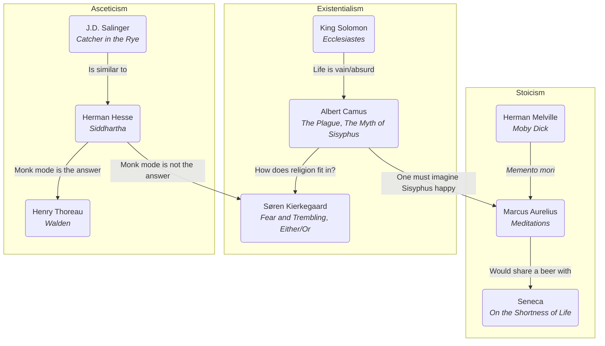

# philosophy-map
A map of my influences and journey from philosophy and literature.

```mermaid
graph TD;
    subgraph Stoicism
    melville(Herman Melville<br><i>Moby Dick</i>)
    aurelius(Marcus Aurelius<br><i>Meditations</i>)
    seneca(Seneca<br><i>On the Shortness of Life</i>)
    melville -- <i>Memento mori</i> --> aurelius -- Would share a beer with --> seneca
    end
    
    subgraph Existentialism
    solomon(King Solomon<br><i>Ecclesiastes</i>)
    camus(Albert Camus<br><i>The Plague</i>, <i>The Myth of Sisyphus</i>)
    kierkegaard(Søren Kierkegaard<br><i>Fear and Trembling</i>, <i>Either/Or</i>)
    solomon -- Life is vain/absurd --> camus -- How does religion fit in? --> kierkegaard
    end

    subgraph Asceticism
    salinger(J.D. Salinger<br><i>Catcher in the Rye</i>)
    hesse(Herman Hesse<br><i>Siddhartha</i>)
    thoreau(Henry Thoreau<br><i>Walden</i>)
    salinger -- Is similar to --> hesse -- Monk mode is the answer --> thoreau
    end

    camus -- One must imagine Sisyphus happy --> aurelius

    hesse -- Monk mode is not the answer --> kierkegaard

```
